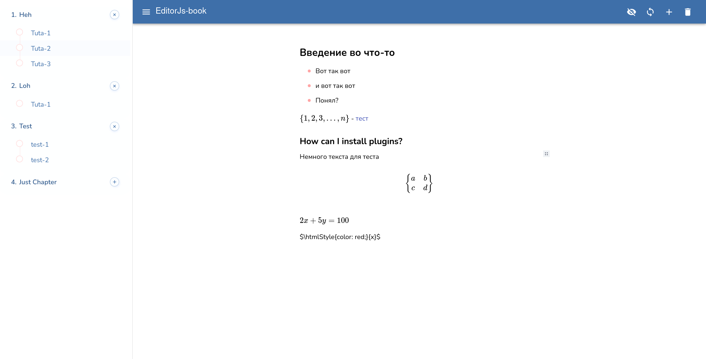

# Editorjs-book

In-browser editor with editorjs in its core



## Getting Started

#### Installation

```bash
git clone https://github.com/CursedWizard/editorjs-book.git
cd editor-js-book/backend/
npm install
cd js/
# create info.json file and fill it with the following line: { "chapterDir": "./chapters" }
# or give it any path you want but make sure a folder with the name specified exists
echo "{ \"chapterDir\": \"./chapters\" }" > info.json
# make sure folder exists
mkdir chapters
node index.js
```

